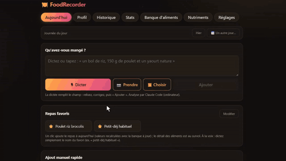

# FoodRecorder

**Journal nutritionnel qu'on remplit à la voix ou en photo, pensé pour ce qu'on fait des données *après*.** 
Stats, données à observer, laissant l'utilisateur libre avec ses données comme j'aime.
React + TypeScript, tout dans le navigateur, extraction des nutriments par LLM (Claude) (API ou CLI voir plus bas)

<p align="center">
  
</p>

<!-- ▶ **[Démo complète (30 s)](https://github.com/Arcturyus/FoodRecorder)** -->


C'est un **projet perso**, à prendre avec la modération qui va avec : je l'ai fait d'abord pour moi, je l'utilise souvent, et il reste plein de choses à faire.

Et y a un petit coté fourre tout à plein de fonctionnalités, pas user friendly vu que c'est pour moi à la base.


Des grosses parties de ce projet sont écrites par des agents IA, micro managé avec énormément d'iterations, quelques points clés ou bug sont  corrigés, refait ou reverifiés par moi.

---

## Le projet

J'ai tester des applis de comptage de calories. Y en a vraiment plein mais j'aimais pas trop, ca ne faisait pas ce que je voulais. Saisie, dictée, photo IA ca marche bien. Ce qui m'a manqué, c'est **tout ce qui vient après** : l'analyse est pauvre, notamment statistiques très génériques alors qu'on peut analyser ses données en profondeur.

C'est le but de FoodRecorder. Une fois que les repas sont enregistrés, on peut mieux comprendre son alimentation:


- **voir ce qui manque**, nutriment par nutriment, sur la période de son choix, et donc visualiser des aliments utiles, comparer, comprendre aussi si on a un vrai manque ou si ce nutriment les AJR ne sont pas bien qualifiés.
- **explorer la base visuellement** : nuages de points avec frontière de Pareto (maximiser deux éléments, maximiser l'un tout en minimisant un autre...), chercher les aliments qui complètent les nutriment qu'on manque sans monter ce qu'on veut pas.

Le reste ressemble à ce que font les autres applis. Ladifférence est dans ces angles-là.


---

## Démarrer

### Démo en ligne, sans rien installer

**→ [arcturyus.github.io/FoodRecorder](https://arcturyus.github.io/FoodRecorder/)**

Le site est redéployé à chaque push sur `main` par GitHub Actions
([`.github/workflows/deploy.yml`](.github/workflows/deploy.yml) : install, tests, build, publication sur
GitHub Pages — si les tests cassent, rien ne part).

Tout marche sauf deux choses, qui ont besoin du serveur de dev local : le **pont CLI** et les
sauvegardes automatiques sur disque. En ligne, l'extraction se fait donc au parseur à règles, ou avec une
**clé API** d'un fournisseur compatible, collée dans Réglages.

### En local

```bash
cd web
npm install
npm run dev      # http://localhost:5173
npm test         # 33 fichiers de tests (matching, parseur, calculs, sync…)
npm run build    # build de production
```

> ⚠️ C'est une démo : l'instance déployée pointe sur **mon** projet Supabase (URL et clé anonyme injectées
> au build par des secrets GitHub). Créer un profil dessus écrit donc sur ma base gratuite. Pour un usage
> réel, il faut cloner le repo, connecter son propre projet Supabase en mettant `VITE_SUPABASE_URL` et
> `VITE_SUPABASE_ANON_KEY` dans `web/.env.local`. Sans ces deux variables, le client n'est simplement pas
> construit : la synchro disparaît de l'interface et l'app fonctionne en 100 % local.

### Créer son profil (sauvegarde et synchro)

Par défaut, les données vivent dans le `localStorage` **d'un seul navigateur** : un nettoyage d'historique et
tout est perdu. C'est à ça que sert le profil — et c'est aussi lui qui permet de saisir depuis le téléphone
et de retrouver ses repas sur l'ordinateur.

Dans **Réglages → « Profil & synchronisation cloud »** :

1. un **nom** de profil (il doit être libre : sous le capot il devient un compte Supabase Auth) et un **mot
   de passe** de 6 caractères minimum ;
2. **« Créer ce profil »** — les données déjà présentes dans ce navigateur sont envoyées telles quelles ;
3. sur un deuxième appareil, mêmes identifiants puis **« Rejoindre… »**. L'app affiche d'abord un
   comparatif (*ce navigateur : 12 repas · profil cloud : 340 repas*) et laisse choisir : télécharger le
   profil, écraser le cloud avec le local, ou fusionner. Dans tous les cas une sauvegarde JSON du navigateur
   est téléchargée avant d'agir.

Ensuite, ça se synchronise tout seul toutes les 30 s, en local-first : le navigateur reste la source
immédiate, la synchro rattrape en arrière-plan et ne fait rien de plus qu'attendre quand on est hors ligne.

Deux choses à savoir :

- **Le mot de passe est la seule protection du profil, et il n'y a aucune récupération possible.** Pas
  d'e-mail, pas de « mot de passe oublié ».
- Il est attaché **au profil, pas à l'appareil** : tous les appareils d'un même profil partagent le même.
  Le changer déconnecte donc tout le monde — ce qui est aussi la façon de révoquer un appareil perdu.

### Quelle IA brancher

Les fonctionnalités LLM (comprendre une phrase dictée, lire une photo de repas, estimer un aliment inconnu,
relire une fiche nutritionnelle) peuvent utiliser une clé API ou un pont vers un CLI local :

| Mode | Ce qu'il faut | Où ça marche |
|---|---|---|
| **Clé API** *(recommandé)* | une clé API personnelle, collée dans Réglages ; certains fournisseurs proposent un palier gratuit pour tester, avec des quotas et conditions variables ; Claude (Anthropic), Gemini (Google), GPT (OpenAI), Mistral, OpenRouter ou Groq | partout, y compris mobile |
| **Pont CLI** | le CLI `claude` ou `codex` installé et **déjà connecté** à votre compte — aucune clé API à saisir | ordinateur qui exécute `npm run dev` |

Le pont réutilise simplement la session du CLI : le navigateur appelle un middleware Vite local
([`web/vite-plugin-claude-code.ts`](web/vite-plugin-claude-code.ts)) qui lance le CLI choisi à sa place, et
archive chaque appel (prompt, raisonnement, coût, tokens) dans `response/` pour pouvoir relire après coup
ce que le modèle a compris.

Attention : avec une clé API, les appels partent directement de votre navigateur vers le fournisseur choisi.
Votre clé API est conservée localement dans ce navigateur et peut être visible dans ses outils de développement.
Utilisez uniquement votre propre clé, sur un appareil de confiance, et surveillez les limites de facturation de
votre fournisseur. Aucun compte Supabase n'est nécessaire si vous utilisez l'application sur un seul appareil.

Deux autres modes existent — un **parseur à règles** en français, 100 % hors-ligne, qui sert de défaut et de
filet de sécurité quand le LLM échoue, et une **IA locale open source** (WebLLM / WebGPU). Le parseur à
règles reste limité, même sur des phrases simples ; il est surtout là comme solution gratuite et hors-ligne.
L'IA locale, elle non plus, n'est pas au niveau pour cet usage : je la garde par curiosité, pas comme une
vraie option.

### Depuis le téléphone

Les deux appareils connectés au même profil, le téléphone dépose sa dictée ou sa photo dans une file
Supabase ; l'ordinateur, qui a le pont Claude Code, la traite et l'enregistre ; la synchro d'état la renvoie
ensuite à tous les appareils. On garde donc un bon modèle sans avoir de clé API sur le mobile — au prix
d'avoir laissé l'ordinateur allumé.

---

## Ce qui est suivi

Une fiche d'aliment fait une quarantaine de valeurs pour 100 g :

- **Macros** : calories, protéines, glucides, lipides, fibres.
- **Lipides en détail** : AG saturés, séparés en **part qui fait monter le LDL** (palmitique + myristique) et
  part **neutre** (stéarique) — c'est ce qui rend un chocolat noir bien moins « mauvais » que son chiffre
  brut d'AG saturés ne le laisse croire. Plus les trans, mono- et poly-insaturés, oméga-3 (ALA / EPA / DHA,
  l'ALA pondéré ×0,1 pour son mauvais rendement de conversion), oméga-6 et oméga-9.
- **Minéraux** : fer, magnésium, potassium, calcium, zinc, sodium. **Oligo-éléments** : sélénium, iode.
- **Vitamines** : A, C, D, E, K1, **K2**, B1, B2, B3, B5, B6, B9, B12.
- **Divers** (compléments): créatine, collagène.

K2 et créatine sont absents des tables officielles (CIQUAL) : valeurs saisies à la main depuis la
littérature pour les viandes, poissons, œufs, fromages et beurre.

Au-delà des totaux, l'app suit aussi des **rapports** (ω6/ω3, K/Na, Ca/Mg), une estimation de la
**vitamine D gagnée au soleil** (modèle qui croise saison, heure, durée, surface de peau et crème solaire),
le **poids** et ses dérivés (IMC, Harris-Benedict, Mifflin-St Jeor, masse squelettique), et une
**incertitude sur les calories** du jour — parce qu'un « un bol de riz » dicté ne vaut pas une pesée, et
que l'app le dit au lieu de faire semblant.

Chaque nutriment a une fiche explicative qui affiche d'abord **la solidité de ce qu'on avance** : à quelle
dose la carence pose problème, ce que la molécule fait, ce qu'on gagne (ou non) à dépasser l'AJR, et à
partir de quand ça devient risqué. Quand rien n'est établi, c'est écrit — pas de seuil inventé.

---

## La banque d'aliments

Deux ensembles cohabitent, et c'est le cœur du modèle :

- un **catalogue de référence** de 148 aliments courants écrit en dur, qui sert de réservoir et de fixture
  au matching hors-ligne — il n'est **jamais** compté dans les stats ;
- **ma banque** : tout ce que j'ai réellement mangé au moins une fois, d'où que ça vienne (copié du
  catalogue, estimé par l'IA pour un aliment hors catalogue, ou saisi à la main). C'est la seule source des
  calculs et des stats.

Un aliment inconnu entre dans la banque dès la première fois, avec un badge « à vérifier ». Ses valeurs
sont **figées à la première estimation** puis éditables, et toute correction est **rétroactive** sur
l'historique — sinon le même plat vaudrait deux valeurs différentes selon le jour et les courbes ne
voudraient plus rien dire. L'entretien de la banque peut se faire avec l'IA : reclassement groupé des
catégories, et relecture d'une fiche **sous forme de discussion** où l'on peut objecter (« les miennes sont
à l'huile ») et où le modèle révise ou maintient son avis, en tenant compte de la consommation réelle.

---

## Structure

```
web/
  src/
    nutrition/   catalogue, banque, matching flou, AJR, dépense énergétique, ACP, reco   (TS pur, testé)
    extraction/  parseur à règles FR · WebLLM · API Claude · pont Claude Code · schéma zod
    stt/         dictée : reconnaissance native du navigateur ou Whisper (transformers.js)
    sync/        file Supabase (téléphone → ordinateur) + synchro d'état par profil
    store/       Zustand, persistance localStorage, sauvegardes
    sun/ weight/ vitamine D solaire, pesées et dérivés
    ui/          composants React (D3 pur pour les graphes, pas de lib de charts)
  tests/         Vitest
analysis/        notebook Python qui refait l'ACP de l'app à la main (cours / vérification)
plan.md          plan d'exécution initial (dont le portage mobile React Native, pas encore fait)
idées.md         ce qui reste à faire, et pourquoi certaines pistes ont été écartées
```

---


## Statut

**Première version.** Il reste beaucoup à faire

Cela dit, pour mon usage personnel, elle m'est déjà bien plus utile que les applis que j'ai pu tester.
